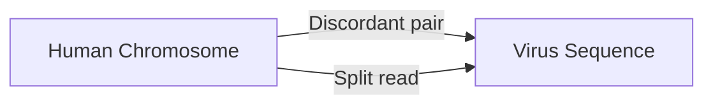
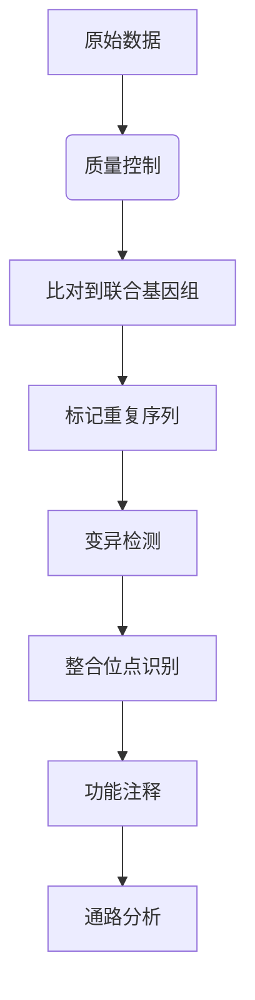

代码
'''
#!/usr/bin/env bash
# align_human_virus.sh  简明版 + 国内源环境加载
# 步骤：配置国内 Conda 源，激活环境，合并参考、索引、比对、排序、索引、统计

# ---- 0. 配置国内 Conda 源（首次运行） ----
# conda config --add channels https://mirrors.tuna.tsinghua.edu.cn/anaconda/pkgs/main/
# conda config --add channels https://mirrors.tuna.tsinghua.edu.cn/anaconda/pkgs/free/
# conda config --add channels https://mirrors.tuna.tsinghua.edu.cn/anaconda/cloud/bioconda/
# conda config --set show_channel_urls yes

# ---- 1. 创建并激活环境（如未创建） ----
if ! conda env list | grep -q bioinfo; then
  conda create -y -n bioinfo bwa samtools
fi
source $(conda info --base)/etc/profile.d/conda.sh
conda activate bioinfo

# ---- 2. 合并人类和病毒基因组 ----
cat /public/DATA/common_data/genome/hg38/GRCh38.primary_assembly.genome.fa \
    ~/genome/TTMV.fa > human_virus.fa

# ---- 3. 建立 bwa 和 samtools 索引 ----
bwa index human_virus.fa
samtools faidx human_virus.fa

# ---- 4. 用 bwa mem 比对，输出 sam ----
bwa mem -t 12 human_virus.fa zzq_1.clean.fq.gz zzq_2.clean.fq.gz > zzq_hv.sam

# ---- 5. 把 sam 转成排序好的 bam ----
samtools sort -@ 12 -o zzq_hv.sorted.bam zzq_hv.sam

# ---- 6. 给排序后的 bam 建立索引（生成 .bai） ----
samtools index zzq_hv.sorted.bam

# ---- 7. 生成比对统计报告 ----
samtools flagstat zzq_hv.sorted.bam > zzq_hv.flagstat.txt

# ---- 完成提示 ----
echo "done: zzq_hv.sorted.bam, zzq_hv.sorted.bam.bai, zzq_hv.flagstat.txt"
'''


从生物学的角度详细解析整个流程，每个步骤背后的生物学意义和原理。这个流程实际上是在进行**病毒整合位点检测**，这是癌症基因组学和病毒学研究中的重要分析。

---

### 生物学背景：病毒整合与疾病
1. **病毒整合现象**：
   - 某些病毒（如HPV、HBV、HIV）能将其DNA整合到宿主基因组中
   - 整合可能导致：
     - 原癌基因激活（如MYC, ERBB2）
     - 抑癌基因失活（如TP53）
     - 基因组不稳定性增加
   - 与多种癌症相关：宫颈癌（HPV）、肝癌（HBV）、淋巴瘤（EBV）

2. **TTMV病毒**：
   - Torque Teno Mini Virus (TTMV) 属于Anellovirus属
   - 在人群中广泛存在（>90%成人携带）
   - 目前尚未确认其致病性，但可能与免疫抑制状态相关

---

### 实验设计原理
您的工作流程本质上是在检测：


---

### 关键步骤的生物学解释

#### 1. 构建联合参考基因组
```bash
cat GRCh38_fixed.fa TTMV.fa > fixed_human_virus_corrected.fa
```
- **生物学意义**：
  - 创建"人工染色体"：将病毒基因组作为独立"染色体"加入人类参考基因组
  - 使比对工具能同时识别：
    - 人类基因组区域（chr1-chrY）
    - 病毒基因组区域（MN772835.1）
  - 当测序read同时匹配人类和病毒序列时，提示可能的整合事件

#### 2. BWA比对
```bash
bwa mem -t 12 fixed_ref.fa read1.fq read2.fq
```
- **核心算法**：Burrows-Wheeler变换
- **生物学解读**：
  1. **种子延伸**：
     - 将短read切割为更小的k-mer
     - 在参考基因组上寻找精确匹配的"种子"
     ```python
     # 示例：read "ATCGCTA"的种子搜索
     k-mers = ["ATC", "TCG", "CGC", "GCT", "CTA"]
     ```
     
  2. **局部比对**：
     - 允许少量错配/插入缺失（适应遗传变异）
     - 使用Smith-Waterman算法优化比对

  3. **配对信息利用**：
     - 对于双端测序数据：
       - 正常情况：两端的距离和方向应符合文库大小
       - 整合提示：一端比对到人类基因，另一端比对到病毒基因

#### 3. IGV可视化解读
当您在IGV中看到：

- **整合证据类型**：
  1. **跨域配对**：
     - 一个read pair中：
       - Read1 比对到人类基因（如chr3:129,000）
       - Read2 比对到病毒序列（MN772835.1）
     - 距离不符合预期文库大小

  2. **断裂读取**：
     - 单个read被分为两部分：
       - 前半段匹配人类基因
       - 后半段匹配病毒序列
     - 提示精确断点位置

  3. **覆盖度异常**：
     - 病毒区域出现非均匀覆盖
     - 整合位点附近覆盖度突然升高

---

### 生物信息分析流程
完整的工作流程及其生物学目的：


#### 关键生物分析模块：
1. **整合位点检测工具**：
   - `viralFusionSeq`
   - `VirusFinder`
   - `ViFi`

2. **功能影响预测**：
   - 整合位点是否位于：
     - 基因启动子区（影响表达）
     - 外显子区（可能产生融合蛋白）
     - 脆性位点（如常见癌症相关区域）

3. **临床相关性分析**：
   - 检查已知癌症基因中的整合：
     ```r
     # 示例癌症基因列表
     cancer_genes <- c("TP53", "MYC", "PTEN", "EGFR", "ALK")
     ```
   - 比较公共数据库（如COSMIC）中的整合热点

---

### 实际生物学案例
如果您在分析中发现了整合事件：

1. **典型报告格式**：
   | 染色体位置 | 病毒位置 | 附近基因 | 功能影响 |
   |------------|----------|----------|----------|
   | chr8:128,746,291 | MN772835.1:2,158 | MYC | 启动子上游2kb |

2. **生物学解释**：
   - MYC基因是重要的原癌基因
   - 病毒整合在MYC上游可能：
     - 引入病毒增强子元件
     - 破坏调控区域
     - 导致MYC过表达
   - 与伯基特淋巴瘤中EBV整合类似机制

---

### 后续研究方向建议
1. **实验验证**：
   - PCR验证整合断点
   - RNA-seq检测融合转录本
   - FISH（荧光原位杂交）确认细胞定位

2. **多组学整合**：
   ```mermaid
   graph LR
   DNA[整合位点] --> RNA[融合转录本]
   RNA --> Protein[异常蛋白]
   Protein --> Function[细胞表型]
   ```

3. **临床相关性**：
   - 分析整合频率与临床预后的关系
   - 比较不同亚型患者的整合图谱
   - 探索作为生物标志物的潜力
