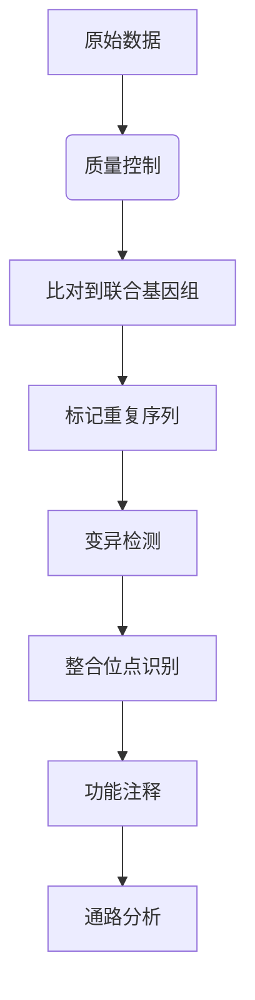

这是从参考基因组准备到序列比对数据处理再到可视化的全过程的教程，按照标准二代测序（NGS）流程逻辑，教程会说明每一步的作用与成果。

---

 ✅ 1. 目标理解与工作方向明确

明确本项目的核心目标：

> 利用病人样本中的 DNA 测序数据，通过比对人类参考基因组，检测是否存在病毒序列插入（例如 TTMV），并定位其位置。

---

 ✅ 2. 参考基因组下载与定位

找到可用的人类基因组文件：
 例如：
 文件名：GRCh38.primary_assembly.genome.fa
 位置：/public/DATA/common_data/genome/hg38/

📌 作用：这是一份国际标准的人类基因组序列，作为比对的“参照”。

---

 ✅ 3. 复制参考基因组到个人工作目录

将 GRCh38.primary_assembly.genome.fa 复制到你自己的工作目录中：

bash
cp /public/DATA/common_data/genome/hg38/GRCh38.primary_assembly.genome.fa ~/genome/


📂 你的工作目录路径为：/public/home/shenyz/genome/

---

 ✅ 4. 为人类基因组构建 BWA 索引

使用 bwa index 为参考基因组构建索引：

bash
bwa index GRCh38.primary_assembly.genome.fa


🔧 输出文件包括：

 .amb, .ann, .bwt, .pac, .sa

📌 作用：BWA 索引能让后续比对迅速定位参考序列，提高效率。

---

 ✅ 5. 原始测序数据（样本 FASTQ）准备

已经准备好的成对的 clean FASTQ 文件：

bash
zzq_1.clean.fq
zzq_2.clean.fq


✅ 这通常来自于下游质控工具的输出，如：Trimmomatic、fastp

---

 ✅ 6. 掌握 Seqkit 并完成质控统计

安装 seqkit 并使用以下命令进行基本质量统计：

bash
seqkit stats -j 12 zzq_1.clean.fq zzq_2.clean.fq


📊 得到的信息包括：

 总序列数
 总碱基数
 N50、GC 含量、最大/最小序列长度等

📌 作用：确认数据规模与质量，为比对和后续分析提供判断依据。

---

 ✅ 7. 掌握了多线程比对命令的写法

学会如何使用 bwa mem 多线程比对：

bash
bwa mem -t 12 GRCh38.primary_assembly.genome.fa zzq_1.clean.fq zzq_2.clean.fq > zzq.sam 2> bwa_mem.log


📌 作用：将样本 DNA 序列与参考基因组比对，输出 .sam 格式文件以供下游处理。

---

 ✅ 8. 发现流程问题并及时修正思路

例如更优解：

> 应该将病毒基因组（如 TTMV）和人类参考基因组合并，再构建索引并比对。这样才能让 BWA 识别病毒插入序列。

已经具备如下条件：

 TTMV.fa 病毒序列已在工作目录中
 合并 fasta 的做法：

bash
cat GRCh38.primary_assembly.genome.fa TTMV.fa > human_virus.fa


 已准备重新索引并比对

---

 🧩 到目前为止的关键成果汇总

| 模块      | 完成情况 | 说明                          |
| ------- | ---- | --------------------------- |
| 项目目标理解  | ✅    | 明确目标是检测病毒插入片段               |
| 环境准备    | ✅    | 安装了 BWA、Seqkit，掌握了 Linux 操作 |
| 基因组文件准备 | ✅    | 下载并索引了 GRCh38               |
| 测序数据准备  | ✅    | clean FASTQ 文件就绪            |
| 数据统计与质控 | ✅    | 使用 seqkit 获取质量指标            |
| 比对流程掌握  | ✅    | 熟悉 bwa mem 和后台运行（nohup）   |
| 方法更新    | ✅    | 明白需要合并人类+病毒序列参考基因组          |

---

 ✅ 下一步推荐操作（按顺序）

1. 合并参考基因组并索引

bash
cd ~/genome
cat GRCh38.primary_assembly.genome.fa ~/TTMV.fa > human_virus.fa
bwa index human_virus.fa


2. 重新运行比对任务

bash
nohup bwa mem -t 12 human_virus.fa ~/zzq_1.clean.fq ~/zzq_2.clean.fq > zzq_hv.sam 2> bwa_hv.log &


3. 后处理：转换为 BAM、排序、建索引

bash
samtools view -Sb zzq_hv.sam > zzq_hv.bam
samtools sort zzq_hv.bam -o zzq_hv.sorted.bam
samtools index zzq_hv.sorted.bam


4. 可视化比对结果：在 IGV 中加载 human_virus.fa 和 zzq_hv.sorted.bam


###实测能用的命令：

这个命令做清洗
fastp \
  -i zzq_1.fq.gz \
  -I zzq_2.fq.gz \
  -o zzq_1.clean.fq.gz \
  -O zzq_2.clean.fq.gz \
  -w 12 \
  --detect_adapter_for_pe \
  --thread 12 \
  --html fastp_report.html \
  --json fastp.json


这个命令做比对
# 进入genome目录（如果当前不在该目录）
cd ~/genome

# 使用BWA进行比对，12线程，输出进度信息
bwa mem -t 12 -p -v 1 \
  fixed_human_virus.fa \
  ../zzq_1.clean.fq.gz ../zzq_2.clean.fq.gz \
  2>&1 | tee bwa_alignment.log | grep -E '^\[M::|Processed'

# 将SAM转换为排序的BAM文件（使用12线程）
samtools sort -@ 12 -O bam -o zzq_hv_sorted.bam zzq_hv.sam

# 创建BAM索引
samtools index -@ 12 zzq_hv_sorted.bam

# 清理临时文件（可选）
rm zzq_hv.sam


从生物学的角度详细解析整个流程，每个步骤背后的生物学意义和原理。这个流程实际上是在进行**病毒整合位点检测**，这是癌症基因组学和病毒学研究中的重要分析。

---

### 生物学背景：病毒整合与疾病
1. **病毒整合现象**：
   - 某些病毒（如HPV、HBV、HIV）能将其DNA整合到宿主基因组中
   - 整合可能导致：
     - 原癌基因激活（如MYC, ERBB2）
     - 抑癌基因失活（如TP53）
     - 基因组不稳定性增加
   - 与多种癌症相关：宫颈癌（HPV）、肝癌（HBV）、淋巴瘤（EBV）

2. **TTMV病毒**：
   - Torque Teno Mini Virus (TTMV) 属于Anellovirus属
   - 在人群中广泛存在（>90%成人携带）
   - 目前尚未确认其致病性，但可能与免疫抑制状态相关

---

### 实验设计原理
您的工作流程本质上是在检测：


---

### 关键步骤的生物学解释

#### 1. 构建联合参考基因组
```bash
cat GRCh38_fixed.fa TTMV.fa > fixed_human_virus_corrected.fa
```
- **生物学意义**：
  - 创建"人工染色体"：将病毒基因组作为独立"染色体"加入人类参考基因组
  - 使比对工具能同时识别：
    - 人类基因组区域（chr1-chrY）
    - 病毒基因组区域（MN772835.1）
  - 当测序read同时匹配人类和病毒序列时，提示可能的整合事件

#### 2. BWA比对
```bash
bwa mem -t 12 fixed_ref.fa read1.fq read2.fq
```
- **核心算法**：Burrows-Wheeler变换
- **生物学解读**：
  1. **种子延伸**：
     - 将短read切割为更小的k-mer
     - 在参考基因组上寻找精确匹配的"种子"
     ```python
     # 示例：read "ATCGCTA"的种子搜索
     k-mers = ["ATC", "TCG", "CGC", "GCT", "CTA"]
     ```
     
  2. **局部比对**：
     - 允许少量错配/插入缺失（适应遗传变异）
     - 使用Smith-Waterman算法优化比对

  3. **配对信息利用**：
     - 对于双端测序数据：
       - 正常情况：两端的距离和方向应符合文库大小
       - 整合提示：一端比对到人类基因，另一端比对到病毒基因

#### 3. IGV可视化解读
当您在IGV中看到：

- **整合证据类型**：
  1. **跨域配对**：
     - 一个read pair中：
       - Read1 比对到人类基因（如chr3:129,000）
       - Read2 比对到病毒序列（MN772835.1）
     - 距离不符合预期文库大小

  2. **断裂读取**：
     - 单个read被分为两部分：
       - 前半段匹配人类基因
       - 后半段匹配病毒序列
     - 提示精确断点位置

  3. **覆盖度异常**：
     - 病毒区域出现非均匀覆盖
     - 整合位点附近覆盖度突然升高

---

### 生物信息分析流程
完整的工作流程及其生物学目的：


#### 关键生物分析模块：
1. **整合位点检测工具**：
   - `viralFusionSeq`
   - `VirusFinder`
   - `ViFi`

2. **功能影响预测**：
   - 整合位点是否位于：
     - 基因启动子区（影响表达）
     - 外显子区（可能产生融合蛋白）
     - 脆性位点（如常见癌症相关区域）

3. **临床相关性分析**：
   - 检查已知癌症基因中的整合：
     ```r
     # 示例癌症基因列表
     cancer_genes <- c("TP53", "MYC", "PTEN", "EGFR", "ALK")
     ```
   - 比较公共数据库（如COSMIC）中的整合热点

---

### 实际生物学案例
如果您在分析中发现了整合事件：

1. **典型报告格式**：
   | 染色体位置 | 病毒位置 | 附近基因 | 功能影响 |
   |------------|----------|----------|----------|
   | chr8:128,746,291 | MN772835.1:2,158 | MYC | 启动子上游2kb |

2. **生物学解释**：
   - MYC基因是重要的原癌基因
   - 病毒整合在MYC上游可能：
     - 引入病毒增强子元件
     - 破坏调控区域
     - 导致MYC过表达
   - 与伯基特淋巴瘤中EBV整合类似机制

---

### 后续研究方向建议
1. **实验验证**：
   - PCR验证整合断点
   - RNA-seq检测融合转录本
   - FISH（荧光原位杂交）确认细胞定位

2. **多组学整合**：
   ```mermaid
   graph LR
   DNA[整合位点] --> RNA[融合转录本]
   RNA --> Protein[异常蛋白]
   Protein --> Function[细胞表型]
   ```

3. **临床相关性**：
   - 分析整合频率与临床预后的关系
   - 比较不同亚型患者的整合图谱
   - 探索作为生物标志物的潜力
